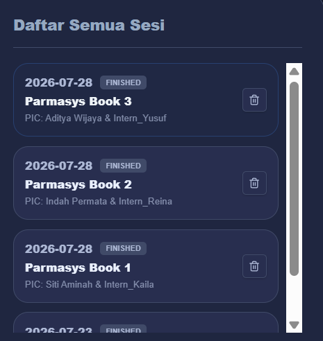
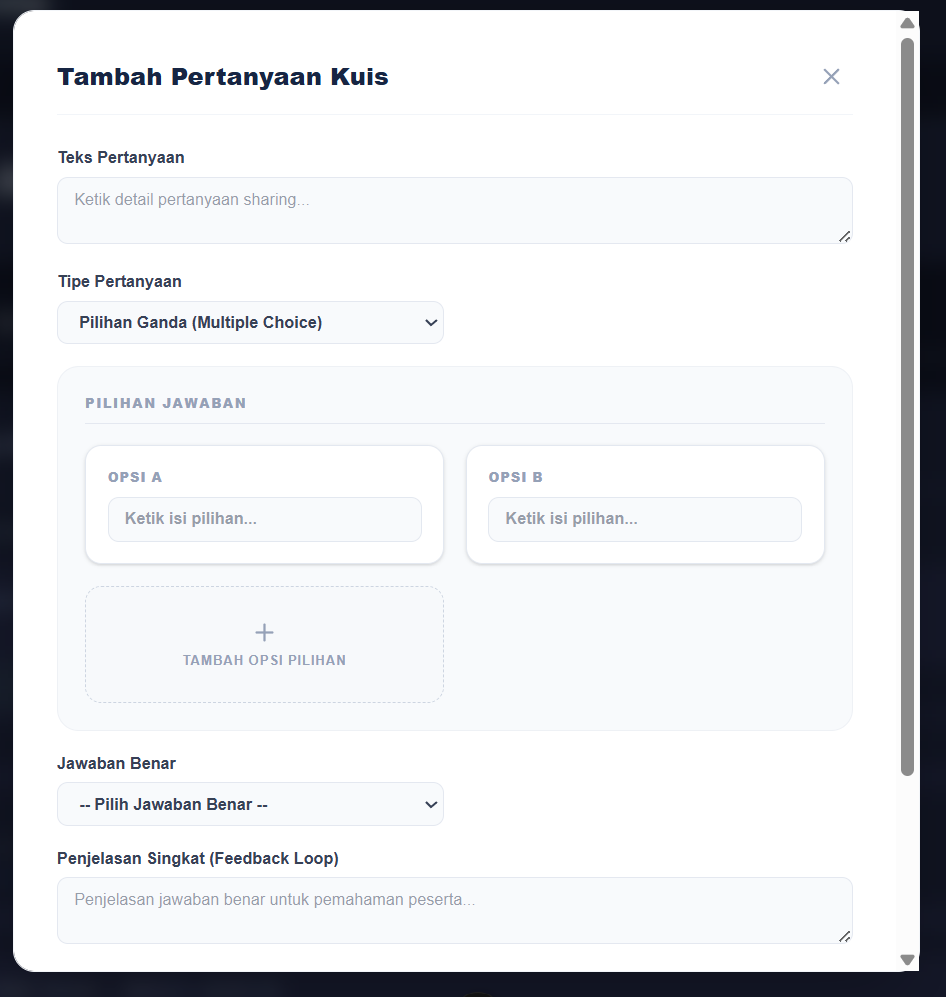
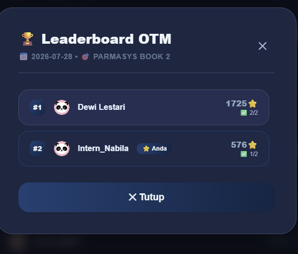

 scroll bar nya masih warna putih
 card tambah soalnya masih warna putih
buat admin bisa melihat catatan leaderboard kayak apa yang user biasa liat, masa admin penglihatannya lebih dikit dibanding user biasa
di peringkat umum > bulanan, masih belum ada avatar di samping namanya
apakah avatar ini disimpan di db? dan setiap mau masuk kuis org bisa aja ganti dan semua itu kecatat di db?? menurut aku cukup di fe aja dan di leaderboard yang di luar sesi kuis gausa ditampilkan avatarnya, cukup sebagai dekorasi pas kuisnya live aja
di list leaderboard, untuk card user yang sedang login, tandai dengan lebih jelas bahwa ini nih card akun lu, klo yg skrg kan cuma nambah shadow dikit dan basenya emg udh gelap, jadi kurang noticeable. contoh kaya ini nih bagus 
